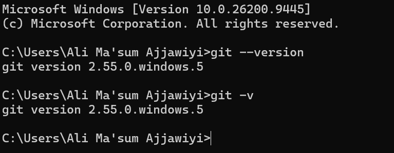
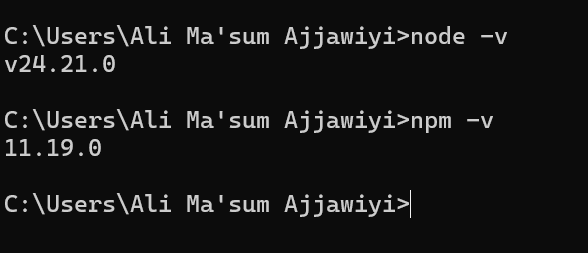
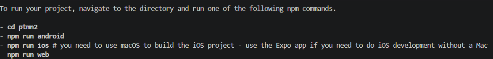

# Praktikum Menyiapkan Lingkungan Pengembangan dan Memulai pemrograman mobile (react native) #

## tujuan pembelajaran ##
mahasiswa mampu :
1. Menyiapkan lingkungan pengembangan dan memulai pemrograman mobile (react native)
2. Membuat aplikasi Mobile dengan react native
3. menyelesaikan tugas CV sederhana dengan react native

## Materi dan laporan praktikum ##
1. Menyiapkan lingkungan pengembangan dan memulai pemrograman mobile (react native)
    - memastikan instalasi git bash
    - cek instalasi git bash ()
    - bukti verifikasi 

- memastikan node.js dan npm
    - Download dan Install Node.js di https://nodejs.org/en/download/
    - konfirmasi Node.js dan NPM (node -v, npm -v)
    

2. Membuat aplikasi / projek baru dengan React Native Framework Expo Go
    - Buka dan baca dokumentasi resmi link https://docs.expo.dev/
    - Buka dan baca dokumentasi resmi link https://reactnative.dev/docs/getting-started
    - Memulai Membuat projek baru
    - open terminal cange directory ke pertemua-2
    - masukan perintah (npx create-expo-app ptmn2 --template blank)
    - bukti verifikasi
    
    - running projek
        - CD ke ptmn-2
        - npx expo strart
        - install expo go di android atau ios
        - bisa juga menggunakan web emulator di laptop / pc
        - setelah berhentikan (ctrl+c)
        - install (npx expo install react-dom react-native-web)
        - npx expo strt --web
3. Tugas Praktikum
  Membuat aplikasi CV sederhana dengan React Native
    - Nama Lengkap
    - NIM
    - Asal Sekolah
    - Cita-cita
    - Rencana Menggapai cita-cita
    - konfirmasi keberhasilan

    
    

    